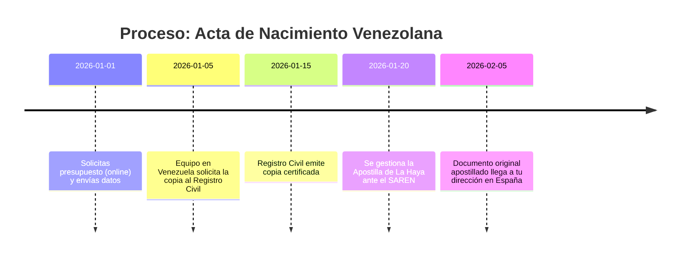
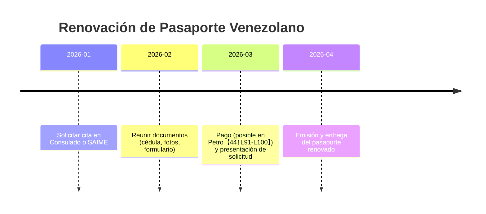
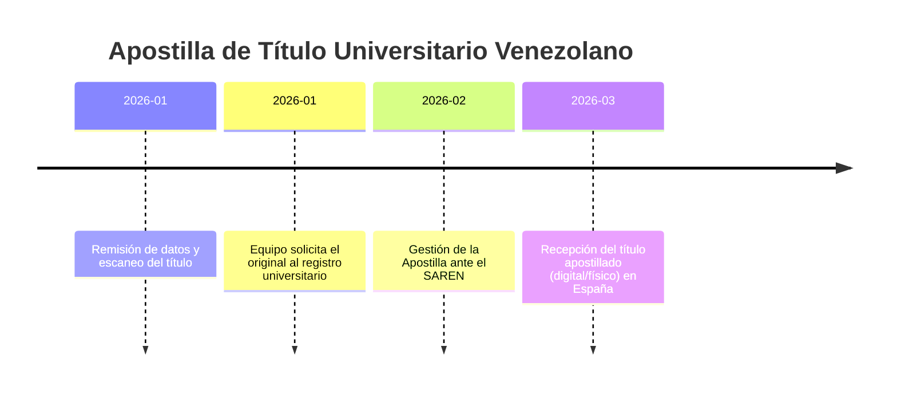
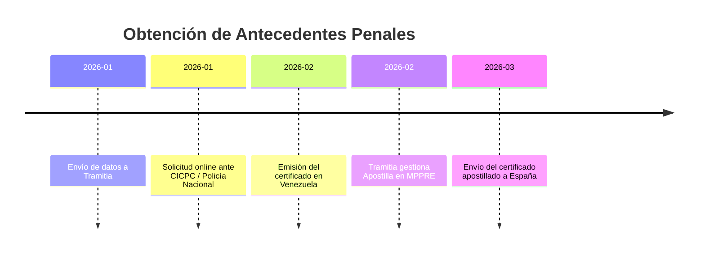
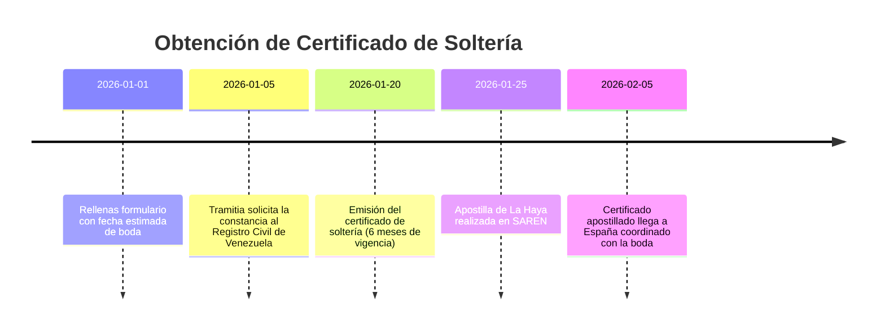
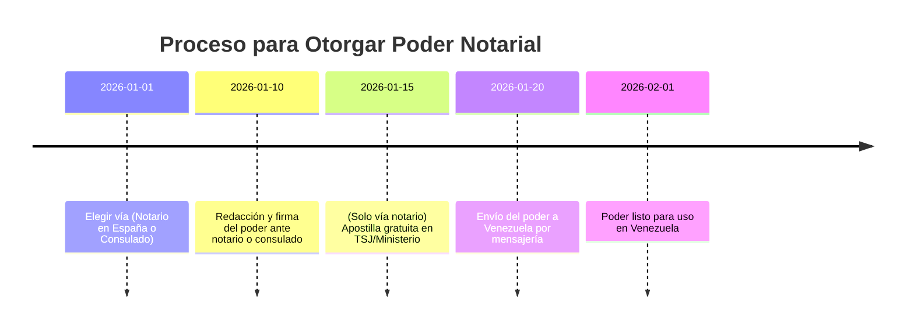

# Resumen Ejecutivo  
Los trámites legales y documentales para venezolanos varían según estén en España o en Venezuela. Tramitia y Venfort destacan la **necesidad de apostillar** documentos venezolanos para que tengan validez en España【10†L96-L100】【57†L96-L98】. Cada servicio (por ejemplo, copia certificada de acta de nacimiento, antecedentes penales apostillados, etc.) exige requisitos distintos según la ubicación del usuario. En España, Tramitia ofrece gestión **100% online**: obtiene la documentación en Venezuela y la entrega apostillada en España【28†L48-L50】【34†L46-L50】. En Venezuela, los trámites suelen hacerse directamente ante organismos locales (Registro Civil, SAIME, SAREN), aunque nuestras fuentes no detallan esos pasos (“no especificado en las fuentes”). A continuación se describe cada servicio, con secciones específicas para **venezolanos en España** y **en Venezuela**, respondiendo preguntas frecuentes, proponiendo CTAs, metadatos SEO, ideas de blog, y un cuadro comparativo de requisitos y plazos.  

## Copia Certificada del Acta de Nacimiento  
**Venezolanos en España:** Tramitia gestiona **online** la obtención de tu partida de nacimiento venezolana con Apostilla de La Haya【28†L48-L50】. Este documento apostillado es clave para **nacionalidad, permisos de residencia y otros trámites** en España【28†L66-L74】. El proceso típico: envías datos y escaneo, ellos solicitan la copia en el Registro Civil en Venezuela y la entregan apostillada en tu domicilio en España【28†L48-L50】【28†L96-L104】.  
**Requisitos (ES):** Originalmente tener los datos del registro (nombre, fecha, lugar) y cédula. Tramitia se encarga de solicitar la copia certificada y apostillarla【28†L48-L50】.  
**Plazo (ES):** Aproximadamente **20–40 días hábiles**【28†L124-L130】.  
**Venezolanos en Venezuela:** Debes solicitar la copia certificada en el Registro Civil donde estés inscrito (SAIME–Registro Civil). Luego, para usarlo en España necesitas **apostillarlo ante el SAREN**, aunque nuestras fuentes no detallan este proceso (“no especificado en las fuentes”).  

**Preguntas Frecuentes:**  
- *¿Puedo tramitar mi acta sin regresar a Venezuela?* Sí, servicios como Tramitia lo hacen online【28†L48-L50】.  
- *¿Qué validez tiene la copia certificada?* Legalmente es equivalente al documento original para trámites españoles tras apostilla【28†L48-L50】.  
- *¿Necesito apostilla?* Sí, sin apostilla el documento **no tiene validez legal en España**【56†L115-L116】.  
- *¿Cuánto cuesta?* (Precio por servicio – **no especificado en las fuentes**).  
- *¿Cómo contactar?* Puedes solicitar presupuesto gratis en la web de Tramitia o Ven Emigra.  

**CTA:** Solicita tu **presupuesto gratis** y gestión documental segura con apostilla. Contáctanos para asesoría personalizada.  
**Meta SEO:**  
- *Título:* “Copia Certificada del Acta de Nacimiento – Obtención y Apostilla”  
- *Descripción:* “Servicio para obtener copia certificada del acta de nacimiento venezolana apostillada. Tramitamos tu documento sin que tengas que viajar【28†L48-L50】.”  
- *Slug:* `/copia-certificada-acta-nacimiento`  

**Ideas de blog:**  
- ¿Por qué necesitas tu acta de nacimiento apostillada en España?  
- Guía paso a paso: Copia certificada de nacimiento venezolana desde el extranjero.  
- Errores comunes al solicitar actas de nacimiento en Venezuela.  
- Nacionalidad española: documentos obligatorios, incluyendo el acta de nacimiento.  
- Preguntas frecuentes sobre partidas de nacimiento venezolanas.  

## Legalización del Acta de Nacimiento  
**Venezolanos en España:** Venezuela es signatario del Convenio de La Haya, por lo que el acta de nacimiento **se apostilla** en lugar de legalizarse por vía consular【57†L96-L98】. La legalización consular tradicional ya no aplica entre Venezuela y España.  
**Venezolanos en Venezuela:** Si necesitas el acta para un país *no* signatario de La Haya, tendrías que hacer una legalización consular; sin embargo, nuestras fuentes no detallan este trámite (“**no especificado en las fuentes**”). 

**Preguntas Frecuentes:**  
- *¿Cuál es la diferencia entre apostilla y legalización?* En países signatarios (como España–Venezuela) se usa la **Apostilla de La Haya**, no legalización consular【57†L96-L98】.  
- *¿Qué validez tiene?* La apostilla permite que el acta venezolana tenga plena validez legal en España【57†L96-L98】.  

**CTA:** Si requieres asistencia, contáctanos para información especializada en convenios internacionales de documentos.  
**Meta SEO:**  
- *Título:* “Legalización del Acta de Nacimiento – Convenio de La Haya”  
- *Descripción:* “En España los actas venezolanas se apostillan (no se legalizan). Te asesoramos sobre cómo gestionar la Apostilla de La Haya para tu acta de nacimiento.”  
- *Slug:* `/legalizacion-acta-nacimiento`  

**Ideas de blog:**  
- Apostilla vs Legalización: qué necesitas según tu destino.  
- Cómo legalizar documentos venezolanos en el extranjero (casos especiales).  
- ¿Es necesaria la legalización si estoy en España? Respuestas clave.  
- El Convenio de La Haya explicado para migrantes venezolanos.  
- Preguntas frecuentes sobre apostillas y legalizaciones consulares.  

## Pasaporte – Renovación – Express  
**Venezolanos en España:** La renovación del pasaporte venezolano debe gestionarse ante el **Consulado de Venezuela** en España. Nuestras fuentes no detallan este proceso (“no especificado en las fuentes”). Recientemente, la SAIME anunció que se podrá pagar la emisión o prórroga del pasaporte con la criptomoneda *Petro*【44†L91-L100】. Si necesitas renovar desde España, coordina cita en consulado y consulta si aceptan pago con Petro【44†L91-L100】.  
**Venezolanos en Venezuela:** Tramitas directamente en **SAIME** (Servicio Administrativo de Identificación). De acuerdo con Venfort, SAIME permitirá pagar emisión/prórroga de pasaporte con Petro【44†L91-L100】, lo que agiliza el pago; no hay más detalles sobre tiempos oficiales. Plazos de espera no se especifican en las fuentes consultadas (“no especificado”).  

**Preguntas Frecuentes:**  
- *¿Cuánto tarda la renovación del pasaporte?* (Datos no encontrados en Tramitia/Venfort – “no especificado en las fuentes”).  
- *¿Puedo pagar en Petro?* Sí, el SAIME anunció que aceptará Petro para pasaportes【44†L91-L100】.  
- *¿Qué documentos necesito?* (No detallado; generalmente cédula, pasaporte anterior y fotos).  

**CTA:** Contáctanos para asesoría sobre trámites consulares y requisitos de identificación venezolana.  
**Meta SEO:**  
- *Título:* “Renovación de Pasaporte Venezolano – Tramítalo desde España”  
- *Descripción:* “Renueva tu pasaporte venezolano ante el Consulado. Infórmate sobre la opción de pago en Petro y requisitos actuales【44†L91-L100】.”  
- *Slug:* `/pasaporte-renovacion-express`  

**Ideas de blog:**  
- Cómo renovar tu pasaporte venezolano en el Consulado de España.  
- Pasaporte expres: ¿qué tanto se ha agilizado su trámite?  
- Métodos de pago en SAIME: del bolívar al Petro.  
- Errores comunes al solicitar prórroga de pasaporte.  
- Documentación necesaria para renovar pasaporte fuera de Venezuela.  

## RIF – Actualización de Datos – Renovación  
**Venezolanos en España:** El RIF (Registro de Información Fiscal) es un trámite interno del SENIAT en Venezuela. No se requiere RIF para vivir en España, por lo que no aplica directamente. Tramitia/Venfort no brindan información sobre RIF desde España (“**no especificado en las fuentes**”).  
**Venezolanos en Venezuela:** Debes actualizar tu RIF ante el SENIAT. El proceso completo (actualización o renovación) se gestiona en oficinas del SENIAT o en línea; **no hay detalles en las fuentes** revisadas. En general, puede requerirse el último RIF emitido y documentos personales.  

**Preguntas Frecuentes:**  
- *¿Necesito mi RIF si vivo en España?* No, para trámites en España el RIF venezolano no suele ser necesario.  
- *¿Cómo actualizo mi RIF?* (Información no encontrada en Tramitia/Venfort – “no especificado en las fuentes”).  

**CTA:** Para dudas fiscales internacionales, consúltanos para orientación profesional.  
**Meta SEO:**  
- *Título:* “Tramitación de RIF Venezolano – Actualización y Renovación”  
- *Descripción:* “Información sobre cómo actualizar o renovar tu RIF en Venezuela. Consulta requisitos y asesoría especializada desde España.”  
- *Slug:* `/rif-actualizacion-renovacion`  

**Ideas de blog:**  
- ¿Qué es el RIF y cómo obtenerlo en Venezuela?  
- Pasos para renovar tu RIF ante el SENIAT (recién emigrados).  
- Beneficios de mantener tus datos fiscales actualizados en Venezuela.  
- Trámites tributarios venezolanos desde el extranjero: consejos básicos.  
- Cambios recientes en la legislación del RIF.  

## Título Universitario Apostillado  
**Venezolanos en España:** Para homologar tu carrera o ejercer, necesitas apostillar tu título universitario. Tramitia gestiona la apostilla de títulos de universidades venezolanas【57†L85-L88】. Este documento apostillado es requisito indispensable en España para **homologar estudios, convalidar títulos y ejercer profesiones reguladas**【57†L85-L88】. El proceso típico: envías tu título o datos escaneados, ellos lo obtienen en Venezuela (Registro Universitario), apostillan en SAREN y te envían copia digital/física.  
**Requisitos (ES):** Título universitario original o constancia de grado. Apostilla ante el SAREN en Venezuela【57†L47-L49】.  
**Plazo (ES):** No especificado, pero la gestión ante SAREN suele tomar varias semanas (por ejemplo, títulos similares tardan unas 4-6 semanas【57†L47-L49】).  
**Venezolanos en Venezuela:** Gestiona el apostillado directamente en el SAREN si necesitas usarlo en el exterior. De otra forma, no necesitas apostilla para trámites dentro de Venezuela.  

**Preguntas Frecuentes:**  
- *¿Cómo saber si mi título está registrado?* Debe estar registrado en el MPPEU; consulta con tu universidad.  
- *¿Puede apostillarse un título desde España?* Sí, Tramitia lo hace remotamente【57†L47-L49】.  
- *¿Es lo mismo copia certificada?* Apostillar requiere el original; una copia certificada apostillada es equivalente.  

**CTA:** Homologa tu título universitario apostillado. Solicita presupuesto personalizado.  
**Meta SEO:**  
- *Título:* “Título Universitario Venezolano Apostillado – Homologación España”  
- *Descripción:* “Obtén la apostilla de tu título universitario venezolano para homologarlo en España【57†L85-L88】. Servicio 100% online por Tramitia.”  
- *Slug:* `/titulo-universitario-apostillado`  

**Ideas de blog:**  
- Guía: Cómo homologar tu título venezolano en España.  
- Título universitario: pasos para apostillarlo desde el extranjero.  
- Homologación vs Convalidación: ¿cuál aplicar según tu caso?  
- Errores frecuentes al tramitar la homologación de títulos.  
- Impacto del apostillado en el proceso de homologación.  

## Certificado de Antecedentes Penales Apostillado  
**Venezolanos en España:** Es obligatorio tener el certificado de antecedentes penales apostillado para casi todo trámite de inmigración (arraigo, residencia, nacionalidad, etc.)【34†L66-L74】. Tramitia obtiene tu certificado ante el CICPC o Policía Nacional en Venezuela y te lo envía con Apostilla de La Haya【34†L46-L50】. Se gestiona 100% online: envías datos y ellos coordinan la solicitud, apostilla y entrega en España【34†L46-L50】【34†L93-L100】.  
**Requisitos (ES):** Documento de identidad y datos completos para solicitud en Venezuela. Apostilla ante el MPPRE/SAREN una vez obtenido el certificado【34†L139-L148】.  
**Plazo (ES):** Aproximadamente **20–40 días hábiles**【34†L139-L148】 (varía según país; en Venezuela suele ser ~3–6 semanas). Vigencia limitada (habitualmente 3 meses) por lo que se coordina con las fechas del trámite【34†L147-L152】.  
**Venezolanos en Venezuela:** Solicitarlo directamente en las oficinas del **CICPC** (antiguo SAIME para antecedentes) de tu región. De acuerdo con Venfort, el CICPC emite certificados y la apostilla la tramita el MPPRE【34†L139-L148】. No se dispone de detalles de costos ni tiempos exactos (“no especificado en las fuentes”).  

**Preguntas Frecuentes:**  
- *¿Para qué sirve este certificado?* Lo exige el Gobierno español en permisos de residencia, nacionalidad, renovaciones de NIE/TIE y empleo público【34†L66-L74】.  
- *¿Apostilla automática?* Sí, debe apostillarse en Venezuela para que valga en España【34†L139-L148】.  
- *¿Validez del certificado?* Generalmente 3 meses tras la emisión【34†L147-L152】.  

**CTA:** Facilita tus trámites de residencia con el certificado de antecedentes penales apostillado. ¡Consúltanos!  
**Meta SEO:**  
- *Título:* “Certificado de Antecedentes Penales Venezolano Apostillado”  
- *Descripción:* “Obtenemos tu certificado de antecedentes penales en Venezuela y lo apostillamos para tu trámite en España【34†L46-L50】【34†L66-L74】. Servicio rápido y seguro.”  
- *Slug:* `/antecedentes-penales-apostillado`  

**Ideas de blog:**  
- Certificado de penales: cuándo y cómo renovarlo (Venezuela).  
- Preparativos para arraigo o nacionalidad: la importancia del penal apostillado.  
- Explicando la vigencia de los antecedentes penales.  
- Preguntas frecuentes sobre antecedentes penales venezolanos.  
- Alternativas cuando no puedes estar en Venezuela para sacar el penal.  

## Carta de Soltería (Certificado de Soltería)  
**Venezolanos en España:** Tramitia también gestiona el **certificado de soltería** (o “fe de soltería”) venezolano apostillado【36†L64-L72】. Es obligatorio para contraer matrimonio o formar pareja de hecho en España si eres soltero venezolano【36†L64-L72】. El proceso: solicitas el servicio indicando fecha estimada de boda; ellos obtienen la constancia de soltería en el Registro Civil venezolano, tramitan la apostilla y te entregan el certificado vigente【36†L64-L72】【36†L99-L107】.  
**Requisitos (ES):** Copia certificada de Acta de Nacimiento y cédula, para comprobar tu estado civil. Apostilla ante SAREN una vez obtenido【36†L146-L154】.  
**Plazo (ES):** Aprox. **20–35 días hábiles**【36†L146-L154】. Este certificado expira en **6 meses** (en Venezuela)【36†L105-L112】, por lo que Tramitia coordina fechas para asegurar vigencia al momento del matrimonio.  
**Venezolanos en Venezuela:** Se solicita en el **Registro Civil** de tu localidad la *constancia de soltería*. Si es para uso internacional, debe apostillarse luego. No hay detalles adicionales en las fuentes.  

**Preguntas Frecuentes:**  
- *¿Para qué sirve la carta de soltería?* Acredita ante las autoridades españolas que no estás casado. Es requisito en el expediente matrimonial【36†L64-L72】.  
- *¿Cuánto dura su validez?* La consular de Venezuela tiene **6 meses** de vigencia【36†L105-L112】. Luego hay que renovarla o sacar una nueva.  
- *¿Necesita apostilla?* Sí, la emitida en Venezuela debe llevar Apostilla de La Haya para casarte en España.  

**CTA:** Casarse en España es más fácil con toda la documentación al día. Pregunta por tu certificado de soltería apostillado.  
**Meta SEO:**  
- *Título:* “Certificado de Soltería Venezolano – Apostillado para Matrimonio”  
- *Descripción:* “Obtén tu certificado de soltería apostillado para casarte en España【36†L64-L72】【36†L99-L107】. Gestión online desde Venezuela.”  
- *Slug:* `/carta-de-solteria`  

**Ideas de blog:**  
- Matrimonio civil en España: documentos que necesitas como extranjero.  
- Vigencia del certificado de soltería venezolano y cómo planificarla.  
- Paso a paso: obtener tu constancia de soltería en Venezuela.  
- Diferencias entre certificado y carta de soltería.  
- Consejos para agilizar los trámites matrimoniales en España.  

## Constancia de Residencia  
**Venezolanos en España:** Este documento (que comprueba tu residencia en Venezuela) **no está cubierto en las fuentes** consultadas (“**no especificado en las fuentes**”). Posiblemente se emite por organismos locales o municipales en Venezuela.  
**Venezolanos en Venezuela:** Habitualmente se obtiene ante un Consejo Comunal o Alcaldía. Si necesitas usarlo en el extranjero, se apostilla. Sin detalles oficiales en Tramitia/Venfort, no hay datos concretos disponibles.  

**Preguntas Frecuentes:**  
- *¿Qué es la constancia de residencia?* Un certificado que acredita domicilio en Venezuela. Sus requisitos varían según la localidad.  
- *¿Se puede apostillar?* Sí, cualquier documento público venezolano puede apostillarse【57†L89-L92】, pero consulte con Tramitia si ofrecen este trámite específico.  

**CTA:** Para consultas sobre documentos poco comunes, escríbenos. Aclaramos cómo gestionar cada caso.  
**Meta SEO:**  
- *Título:* “Constancia de Residencia Venezolana – Trámites”  
- *Descripción:* “Información sobre la constancia de residencia en Venezuela y cómo apostillarla. Asesoría legal y documental para venezolanos.”  
- *Slug:* `/constancia-de-residencia`  

**Ideas de blog:**  
- ¿Qué es la constancia de residencia y para qué sirve?  
- Cómo obtener la constancia de residencia en tu municipio en Venezuela.  
- Documentos necesarios para trámites internacionales: la constancia de residencia.  
- Casos especiales: venezolanos que requieren prueba de domicilio oficial.  
- Legalización y apostilla de comprobantes de residencia.  

## Fe de Vida (Constancia de Supervivencia)  
**Venezolanos en España:** Usualmente requerida para pensiones o trámites bancarios. No encontramos detalles sobre **fe de vida** en Tramitia o Venfort (“**no especificado en las fuentes**”). Generalmente se tramita en el Consulado de Venezuela presentando cédula y fotos.  
**Venezolanos en Venezuela:** Se obtiene ante notario o instituciones públicas (ej. Saime en ciertos estados) para demostrar que estás vivo. Para uso internacional, se apostilla. Sin información específica en las fuentes disponibles.  

**Preguntas Frecuentes:**  
- *¿Para qué sirve?* Certifica que la persona está viva, normalmente para cobrar pensiones o certificar vida en trámites consulares.  
- *¿Se puede apostillar?* Sí, es un documento público que podría apostillarse【57†L89-L92】. Consulta con tu consulado o gestoría para el proceso.  

**CTA:** Contáctanos si necesitas orientación sobre fe de vida y documentos notariales.  
**Meta SEO:**  
- *Título:* “Fe de Vida Venezolana – Trámites”  
- *Descripción:* “Trámite de fe de vida en Venezuela o consulado. Servicios de apostilla y gestión de documentos notariales.”  
- *Slug:* `/fe-de-vida`  

**Ideas de blog:**  
- Cómo obtener tu fe de vida en España: guía para venezolanos.  
- Fe de vida: requisitos en Venezuela y en el extranjero.  
- Apostilla de documentos notariados: cuándo necesitas fe de vida.  
- Fe de vida y pensiones: todo lo que debes saber.  
- Experiencias y consejos al tramitar la fe de vida.  

## Poderes Notariales  
**Venezolanos en España:** Cuando necesitas que alguien actúe por ti en Venezuela, debes otorgar un **poder notarial apostillado**. Tramitia explica dos vías principales【51†L145-L154】【53†L212-L220】: (1) **Notario español + apostilla:** vas a un notario en España, firmas el poder, y luego lo apostillas en el TSJ o Ministerio de Justicia. Este poder se envía a Venezuela y es aceptado sin problema【53†L212-L220】. Es la vía recomendada por su rapidez (la apostilla española es gratuita)【53†L212-L220】【53†L229-L237】. (2) **Consulado venezolano:** solicitas cita en el consulado en España, firmas ante funcionario consular (no requiere apostilla). Ventaja: validez inmediata en Venezuela. Desventaja: citas lentas y tasas consulares【53†L225-L233】. En la práctica, se suele optar por notario español por la dificultad de cita consular【53†L225-L233】.  
**Requisitos (ES):** Pasaporte/NIE vigente. Definir el **tipo de poder** (general, especial, pleitos, etc.) con el notario. Apostilla (solo via 1)【53†L212-L220】【53†L225-L233】.  
**Veneolanos en Venezuela:** Si estás en Venezuela, simplemente vas a un notario público allí y puedes usar el poder local para tramitar en Vzla. Si el poder se usa en el extranjero, se debe apostillar ante el MPPRE. Nuestras fuentes no detallan este caso específico (“no especificado en las fuentes”).  

**Preguntas Frecuentes:**  
- *¿Necesito apostilla si doy poder desde España?* Solo si optas por notario español. El consulado venezolano exime de apostilla【53†L225-L233】.  
- *¿Qué tipo de poder necesito?* Un *poder especial* suele bastar para gestiones puntuales (venta de inmueble, trámites bancarios)【51†L66-L74】. El general otorga más facultades.  
- *¿Cuánto cuesta?* Notario español: 50–200 € según tipo (apostilla gratuita)【53†L299-L307】; Consulado: tasas consulares (30–120 €)【53†L225-L233】.  

**CTA:** Gestiona tu poder notarial sin desplazarte. Asesórate para que tu trámite legal en Venezuela sea válido y expedito.  
**Meta SEO:**  
- *Título:* “Poder Notarial Venezolano desde España – Apostillado”  
- *Descripción:* “Obtén tu poder notarial venezolano desde España. Te guiamos vía notario español + apostilla o consulado【53†L212-L220】【53†L225-L233】 para trámites en Venezuela.”  
- *Slug:* `/poderes-notariales`  

**Ideas de blog:**  
- Poder especial vs general: ¿cuál te conviene?  
- Cómo otorgar un poder desde el consulado venezolano.  
- Poder notarial para trámites inmobiliarios: claves y consejos.  
- Preguntas frecuentes sobre poderes desde el exterior.  
- ¿Qué hacer cuando no encuentras cita consular? Alternativas.  

## Apostilla de La Haya (Tramitación)  
**Venezolanos en España:** La **Apostilla de La Haya** certifica tus documentos venezolanos para su uso legal en España【10†L96-L100】【57†L96-L98】. Es necesaria **para todos los trámites** de extranjería y homologación en España【10†L96-L100】. Tramitia posee un equipo en Venezuela que se encarga de apostillar documentos (nacimientos, penales, títulos, etc.) ante el SAREN【10†L96-L100】【13†L262-L269】. Cada caso se tramita 100% online【28†L48-L50】【57†L47-L49】.  
**Requisitos (ES):** Documento público original emitido en Venezuela. Se envía copia escaneada y, si es necesario, el original es presentado en Venezuela.  
**Plazo (ES):** Depende del país emisor. En Venezuela suele tomar **20–40 días hábiles**【28†L124-L130】 para documentos como partidas o antecedentes. Apostillas de títulos similares tardan similar tiempo.  
**Venezolanos en Venezuela:** Solicitas la apostilla directamente en SAREN (puede ser presencial o vía electrónica). Se presentan documentos certificados por el registro correspondiente. Nuestras fuentes no describen el proceso paso a paso (“no especificado en las fuentes”), pero confirman que el SAREN es la entidad autorizada【13†L262-L269】.  

**Preguntas Frecuentes:**  
- *¿Qué es la apostilla?* Es un sello que valida internacionalmente tus documentos (reconocido en 124 países)【13†L231-L239】.  
- *¿Puedo apostillar desde España?* Sí, Tramitia lo hace por ti【13†L262-L269】. No necesitas ir a Venezuela.  
- *¿Cuánto cuesta?* Hay servicio express, pero en las fuentes no hay precios específicos.  

**CTA:** Apostilla tus documentos venezolanos sin salir de España. Te brindamos apoyo completo en el proceso.  
**Meta SEO:**  
- *Título:* “Apostilla de La Haya para Documentos Venezolanos”  
- *Descripción:* “Gestionamos la apostilla de tus documentos venezolanos (nacimientos, títulos, antecedentes) desde España【10†L96-L100】【57†L47-L49】. Trámite rápido y seguro.”  
- *Slug:* `/apostilla-haya-venezuela`  

**Ideas de blog:**  
- Guía definitiva de la Apostilla de La Haya para venezolanos.  
- ¿Por qué necesito apostillar mis documentos en España?  
- Diferencias entre apostilla electrónica y física.  
- Pasos para apostillar cualquier documento venezolano desde el extranjero.  
- Checklist de documentos para migrantes: ¿apostillarlos o no?  

## Comparativa de Requisitos y Plazos (España vs Venezuela)  

| **Servicio**                        | **Requisitos (España)**                          | **Plazos (España)**         | **Requisitos (Venezuela)**                  | **Plazos (Venezuela)**       |
|-------------------------------------|--------------------------------------------------|-----------------------------|---------------------------------------------|------------------------------|
| Acta Nacimiento (copia certificada) | Datos del registro civil, cédula, formulario【28†L48-L50】  | ~20–40 días hábiles【28†L124-L130】   | Solicitar en Registro Civil local, cédula   | No especificado en fuentes  |
| Pasaporte (renovación)              | Cita consular (no detallado)                     | No datos disponibles        | SAIME (con foto, cédula)【44†L91-L100】    | No datos disponibles        |
| RIF (actualización)                 | No aplica directamente (SENIAT en Vzla)          | N/A                         | Documentos personales al SENIAT            | No disponible              |
| Título Universitario                | Título original, apostilla SAREN【57†L47-L49】   | Semanas (varía)             | No aplica (uso local sin apostilla)        | N/A                         |
| Título (copia certificada)          | Igual que título original (no fuente)            | N/A                         | Renovarlo o gestionar en universidad       | No datos (no fuente)       |
| Antecedentes Penales                | Cédula; CICPC/SILAIC solicitados online【34†L46-L50】 | ~20–40 días hábiles【34†L139-L147】  | CICPC (sección de antecedentes penales)    | No detallado              |
| Carta de Soltería                   | Cédula, acta nacimiento, matrimonio?【36†L64-L72】 | ~20–35 días hábiles【36†L146-L154】  | Registrar Civil (constancia de soltería)   | No indicado               |
| Residencia (constancia)             | No aplica                                       | N/A                         | Consejo Comunal o Alcaldía local           | No especificado           |
| Fe de Vida                          | Consulado (foto, cédula) (no fuente)             | N/A                         | Notaría o institución local                | No especificado           |
| Poder Notarial (desde España)       | Pasaporte/NIE vigente, formulario notario【53†L212-L220】 | Depende del notario (1-2 semanas) | Notaría local (copia CI)                   | No disponible              |
| Apostilla de La Haya (general)      | Documento público original【13†L262-L269】       | 20–40 días (aprox.)【28†L124-L130】 | SAREN (presentar documento público)        | No detallado              |  

*Fuentes: Documentación oficial de Tramitia y Venfort【28†L48-L50】【34†L46-L50】【36†L64-L72】【53†L212-L220】【57†L47-L49】【44†L91-L100】. “No especificado” indica falta de datos en las fuentes indicadas.*  

**Imágenes/Diagramas sugeridos:** Fotografía de un **Registro Civil o consulado venezolano**, una imagen de ejemplo de **documentos apostillados**, y diagramas de flujo tipo timeline para ilustrar cada trámite. Por ejemplo, use un gráfico de línea de tiempo (Mermaid) para visualizar pasos y plazos de cada proceso.  

**Formato y lenguaje:** Se utiliza un tono profesional y cercano, con párrafos cortos y listas para facilitar la lectura. La información clave se presenta de forma organizada y SEO-amigable, destacando términos relevantes (acta de nacimiento, apostilla, sede consular, etc.) para mejorar la visibilidad en buscadores. Cada sección incluye recursos útiles (FAQs, CTAs, ideas de blog) para optimizar la conversión y el tráfico del sitio web.  

