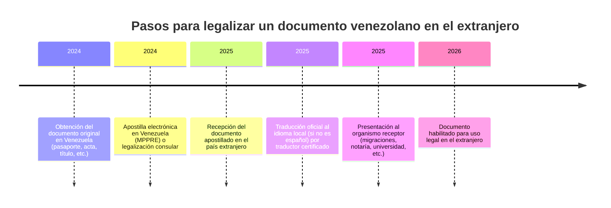

# Resumen Ejecutivo  
Los requisitos documentales para venezolanos varían según el país de residencia, aunque hay patrones comunes. En todos los casos se requiere pasaporte venezolano (o documento oficial) y, para trámites mayores, partidas de nacimiento, certificados de matrimonio/divorcio, antecedentes penales y títulos académicos expedidos en Venezuela. En países firmantes del Convenio de La Haya (casi todos los de la lista, salvo EE.UU. solo en Apostilla), estos documentos deben presentarse *apostillados*; en caso contrario se usaría legalización consular. Los documentos en español sólo requieren traducción certificada en países cuyo idioma oficial no sea el español (por ejemplo, inglés, italiano, portugués o alemán)【86†L45-L49】【104†L97-L104】. 

- **Argentina:** No se exige visa a venezolanos. Se permite ingresar con pasaporte o cédula incluso vencidos (hasta 2 años) gracias a un régimen especial (Disposición 388/2024)【33†L43-L51】. Para solicitar residencia (p.ej. por vínculo familiar) se exigen pasaporte vigente, antecedentes penales apostillados, títulos y certificados académicos apostillados y sus traducciones si fueran idiomas no hispanos【22†L26-L30】. No se necesitan traducciones al español. La cédula venezolana, válida indefinidamente por reformas recientes, conviene renovar en consulado. Existen vías de regularización (Mercosur no aplica a Venezuela actualmente; se usa el régimen humanitario), residencias temporarias o permanentes tras arraigo o vínculo y permiso de trabajo integrado. Hay un registro consular argentino para venezolanos. 

- **Chile:** Desde 2019 los venezolanos deben visa para entrar. Se requiere pasaporte válido y trámite consular previo. Sin embargo, existe flexibilidad temporal: Migraciones acepta pasaportes o cédulas vencidos si el solicitante ha iniciado su renovación【49†L88-L90】. Para residencias temporarias (trabajo, familia, estudios) o definitivas se exige partida de nacimiento y otros certificados (apostillados habitualmente), salvo que no sea posible apostillar – en cuyo caso no se exige legalización consular adicional【49†L100-L107】. Los antecedentes penales sí deben apostillarse electrónicamente【49†L100-L107】. Al ser país hispanohablante, no se requieren traducciones. El sistema de visados actual incluye visas temporarias sujetas a contrato laboral y vías de reunificación familiar. No hay acuerdos migratorios especiales con Venezuela (Venezuela quedó fuera de Mercosur y no hay otro convenio bilateral específico). *Pista:* Chile ya no pide apostilla de documentos civiles venezolanos (sólo de antecedentes) y permite ingreso con documentos caducados bajo condiciones【49†L100-L107】.

- **Perú:** Desde el 2 de julio de 2024 todos los venezolanos **deben visa y pasaporte válido** para entrar【66†L37-L46】. La visa de turismo o humanitaria exige pasaporte con al menos 6 meses de vigencia. Para residencia (p.ej. calidad migratoria especial residente, antes PTP) se necesitan partida de nacimiento, matrimonio y antecedentes penales **apostillados**. Por ser país de habla española, no hay traducción para documentos venezolanos. Los antecedentes penales deben estar apostillados y vigentes. La cédula venezolana no sustituye al pasaporte. Tras obtener estatus migratorio (p.ej. “calidad especial residente” para ex-PTP【59†L119-L127】), se puede tramitar carné de extranjería, permiso de trabajo y eventual nacionalización. Notar que venezolanos con residencia permanente en México, Chile o Colombia (Alianza del Pacífico) están exonerados de visa peruana【61†L30-L39】. Se recomienda registrarse en el consulado peruano para asuntos consulares.

- **Colombia:** Se exige pasaporte (no se usa la cédula para ingreso). Actualmente requiere visa para estancias cortas (se creó recientemente la **Visa V‑Visitante Especial** de 2 años para venezolanos en situación irregular【74†L16-L24】). Los documentos venezolanos principales son pasaporte y (para trámites de visa/residencia) partida de nacimiento, antecedentes penales y demás certificados apostillados. No se requieren traducciones (idioma español). El antiguo Permiso Especial de Permanencia (PEP) y el Estatuto Temporal de Protección (ETPV) han dado paso a estas nuevas visas. Para residencia definitiva (Visa “R”), se piden antecedentes penales apostillados y prueba de permanencia previa【69†L3-L8】. No hay acuerdos Mercosur aplicables a venezolanos; sí se apoya la regularización masiva (alrededor de 2,8 millones) a través del ETPV y visa especial. Se sugiere inscribir el nacimiento de hijos en el Consulado colombiano y tramitar el cédula de extranjería tras obtener Visa R. 

- **Venezuela:** Para un venezolano en su país, los documentos de identidad básicos son la cédula de identidad (SAIME) y el pasaporte. La cédula (vigencia usual de 10 años) ha sido extendida indefinidamente por disposiciones recientes, pero debe renovarse si ha pasado mucho tiempo; el pasaporte (antes 5 años, ahora 10) exige renovación en oficinas de Saime. Para trámites internacionales se usan partidas de nacimiento, certificados de matrimonio/divorcio y títulos escolares, todos apostillados en el MPPRE mediante su sistema electrónico【104†L97-L104】. Los antecedentes penales venezolanos también pueden apostillarse. Dentro del país no hay traducciones ni legalizaciones extra: los documentos oficiales circulan en español. En resumen, en Venezuela un ciudadano necesita sus documentos nacionales al día (cédula y pasaporte) y puede apostillar cualquier documento público para uso en el exterior. 

- **Estados Unidos:** Se exige pasaporte venezolano y **visa** no migrante (p.ej. B1/B2) o categoría migratoria (trabajo, asilo, TPS, etc.). A partir de abril de 2026, las visas B1/B2 requerirán depósito bancario de 5.000–15.000 USD según riesgo nacional【83†L80-L85】. Todos los documentos venezolanos que se presenten ante autoridades de EE.UU. (p.ej. antecedentes penales para asilo, actas civiles para peticiones de familia, títulos para inmigración laboral) deben tener Apostilla de La Haya. Cualquier documento en español debe acompañarse de traducción certificada al inglés (USCIS exige traducción oficial). La cédula no tiene validez legal en EE.UU.; para trámites solo sirve el pasaporte. Los pasaportes deben tener al menos seis meses de vigencia; si el pasaporte vence pero se mantiene una visa válida, se puede viajar con el pasaporte nuevo y el viejo con visa【84†L113-L121】. Los venezolanos pueden optar a TPS (Estatus de Protección Temporal) designado desde 2021 – 2022, si cumplen requisitos, y a las vías regulares de asilo o reunificación familiar. Se recomienda registrarse en el consulado de EE.UU. para ciudadanos venezolanos. 

- **España:** Los venezolanos necesitan pasaporte vigente y visa Schengen para residir o viajar. Para trámites migratorios (residencia laboral, familiar, estudios, etc.) se requieren partida de nacimiento, certificado de antecedentes penales y certificado de matrimonio/divorcio apostillados【86†L45-L49】. Al ser ambos países hispanohablantes, no se precisan traducciones. Entre 2018 y junio 2026 existió una vía *exprés* humanitaria que facilitó la regularización masiva de venezolanos en España (unos 240.000 permisos)【88†L72-L79】. A partir de junio 2026 esa vía concluye; los venezolanos deberán usar los canales ordinarios de visado o solicitud de asilo/inmigración (p.ej. arraigo social/laboral, reagrupación familiar con cónyuge español, oferta de empleo). Los títulos académicos deben homologarse en España (con traducción jurada si no están en español). No hay convenios especiales bilaterales (solo las opciones generales de inmigración de UE). *Tip:* tramitar citas de extranjería con anticipación y verificar requisitos específicos en el Ministerio de Interior. 

- **Italia:** Los venezolanos necesitan pasaporte válido y visa Schengen para estancias >90 días. Para residencias (estudios, trabajo, familiar) se exigen documentos venezolanos apostillados: partidas de nacimiento/matrimonio y antecedentes penales (traducidos al italiano por traductor jurado) y títulos universitarios legalizados【90†L56-L63】. En Italia y otros países de la UE, el español no es oficial, por lo que todo documento debe traducirse al idioma local. Los pasaportes venezolanos deben tener al menos tres meses de validez tras la salida prevista【90†L56-L63】. Muchos venezolanos son descendientes de italianos; aunque no es un convenio oficial, pueden tramitar la ciudadanía por *ius sanguinis*. Italia ofrece residencia temporal por trabajo o estudios (con permiso de soggiorno) y familiar (cónyuge o parientes directos de ciudadanos italianos/comunitarios). No existen acuerdos migratorios específicos con Venezuela. Se recomienda inscribirse en el consulado italiano para obtener asistencia consular y renovar documentos. 

- **Otros países de la UE (reglas generales):** Para todos los países Schengen (y la UE en general) los venezolanos necesitan pasaporte válido y, según el caso, visa de corta estancia o de residencia. Los documentos venezolanos públicos deben apostillarse para ser válidos en la UE. Como en los casos anteriores, cualquier documento en español requerirá traducción oficial al idioma local (francés, alemán, neerlandés, etc.) a cargo de un traductor autorizado. Entre los procedimientos habituales están el **Sistema de Información de Schengen** (apl. de visa corta) y los permisos de residencia nacionales. No hay acuerdos bilaterales especiales adicionales aparte de las normas comunitarias. En resumen: en cualquier país de la UE se aceptan pasaportes y cédulas venezolanas (siempre que sean válidas), y las certificaciones venezolanas (nacimiento, penales, títulos) deben apostillarse y traducirse según la normativa de cada Estado miembro. 

- **Otros países con grandes comunidades venezolanas:** Además de los mencionados, destacan **Brasil, Ecuador, México, República Dominicana** y **Panamá**. En todos ellos se siguen reglas similares: pasaporte venezolano válido (Brasil e Isla aceptan incluso pasaportes venezolanos vencidos sin límite【100†L139-L147】), documentos básicos apostillados y traducciones si el español no es oficial. 

  - *Brasil:* No requiere visa para estancias de turista hasta 90 días (prorrogables a 180)【100†L113-L121】. Brasil incluso acepta pasaportes venezolanos vencidos indefinidamente【100†L139-L147】. La **Operação Acolhida** (desde 2018) facilita atención en frontera: registra migrantes, permite obtener CPF (identificación fiscal) y tramitar visa o residencia humanitaria【100†L173-L180】. Para regularización se pide partida de nacimiento apostillada, certificado penal apostillado (la Convención de La Haya es aplicable) y en general no se exigen traducciones (el portugués se asimila al español, pero oficialmente debe traducirse). Muchos venezolanos obtienen “visto humanitário” o solicitan asilo; Brasil ha reconocido a más de 50.000 venezolanos como refugiados【100†L179-L184】. 

  - *Ecuador:* Entrada sin visa. Ecuador permitió (2019‑2021) a muchos venezolanos tramitar un permiso especial de residencia (TIE), que luego debían convertir en residencia temporal o permanente. Los documentos (nacimiento, matrimonio, penales, títulos) deben apostillarse en Venezuela【104†L139-L147】【104†L152-L156】. Al ser español su lengua oficial, no se requieren traducciones. Para residir se pide tarjeta andina (cedula) o carné de residencia; se aceptan cédulas venezolanas para trámites consulares. Ecuador, miembro de la CAN, no tiene convenio especial con Venezuela, por lo que sigue las normas regulares de extranjería (trámite de visa de trabajo/estudios ante el consulado). 

  - *México:* Desde enero 2022 **requiere visa para todos los venezolanos** que viajen【107†L20-L28】. Se necesita pasaporte con 6 meses de vigencia y la visa mexicana correspondiente (turista, estudiante, laboral, etc.). En el Consulado mexicano en Caracas exigen partida de nacimiento, antecedentes penales y resto de documentos apostillados para visas de residencia o trabajo. El español es el idioma oficial, por lo que no se traducen los documentos. México forma parte de la Alianza del Pacífico; de hecho, venezolanos con residencia en México están exentos de visa para Perú【61†L30-L39】.  

  - *República Dominicana:* No exige visa a venezolanos (solo pasaporte válido). Para residir se debe solicitar ante migración local un permiso (posible presentación de documentos esenciales: partida de nacimiento y antecedentes apostillados, certificado de matrimonio si aplica). Al ser español idioma oficial, no hay traducción. Todos los documentos públicos venezolanos deben apostillarse. Existen convenios mínimos (Comunidad Iberoamericana) pero no un régimen especial bilateral para venezolanos. Se recomienda precaución con los requisitos migratorios (sed ya que migración dominicana puede requerir demostrar solvencia económica).

  - *Panamá:* Requiere visa de turista para venezolanos (aplicar en consulado). Para residir, Panamá pide pasaporte, antecedentes penales apostillados y otros documentos. Panamá también exige pasaporte con 6 meses de validez. Los documentos apostillados se aceptan; las traducciones no son necesarias (idioma oficial es español). Panamá tiene programas de residencia para inversionistas y refugiados, pero no hay régimen especial venezolano. 

A continuación se incluye una tabla comparativa de los documentos venezolanos más comunes y sus requisitos de apostilla/legitimación y traducción por país:  

| **Documento venezolano**         | **Argentina**                            | **Chile**                                | **Perú**                                   | **Colombia**                               | **EE.UU.**                                           | **España**                               | **Italia**                                | **Brasil**                               | **Ecuador**                            | **México**                            | **Rep. Dominicana**                   | **Panamá**                             |
|---------------------------------|------------------------------------------|------------------------------------------|--------------------------------------------|--------------------------------------------|-----------------------------------------------------|------------------------------------------|------------------------------------------|-----------------------------------------|----------------------------------------|---------------------------------------|----------------------------------------|----------------------------------------|
| **Pasaporte venezolano**         | Sí; válido (hasta 2 años vencido)【33†L43-L51】 | Sí; válido (acepta vencido)【100†L139-L147】 | Sí; válido con visa (6 meses vigencia)【66†L37-L46】 | Sí; válido con visa o PPT/ETPV            | Sí; válido (6 meses vigencia; visa B1/B2 con fianza)【84†L113-L121】【83†L80-L85】 | Sí; válido (6 meses recomendado)【84†L113-L121】 | Sí; válido (3 meses vigencia)【90†L56-L63】 | Sí; válido (Brasil acepta pasaporte vencido indefinidamente)【100†L139-L147】 | Sí; válido (mercosur/CAN aceptan pasaporte válido) | Sí; válido con visa (6 meses vigencia)【107†L20-L28】 | Sí; válido (sin visa, max. 90 días)          | Sí; válido con visa (6 meses vigencia)  |
| **Cédula de identidad**         | No es pasaporte; no se requiere para ingreso (solo para trámites internos) | No se usa para ingreso/residencia          | No, se exige pasaporte (no como documento migratorio) | No, no es documento oficial de viaje        | No es válido oficialmente                   | No es válido como documento oficial      | No es válido (no sustituye pasaporte)    | Se acepta para trámites internos (CPF, etc.) | Se acepta como ID interno (tarjeta andina)      | No es válido como documento de viaje    | No es válido como documento oficial     | No es válido como documento oficial     |
| **Partida de nacimiento**       | Apostillada (para vínculos familiares)【13†L275-L283】 | Apostillada (no requiere legalización extra)【49†L100-L107】 | Apostillada (requisito de visa o humanitaria)【56†L62-L66】 | Apostillada (para trámites de residencia)  | Apostillada + traducción al inglés (USCIS)            | Apostillada (sin traducción necesaria)  | Apostillada + traducción al italiano    | Apostillada (Operation Acolhida la usa directamente) | Apostillada (Documento civil oficial) | Apostillada (requisito de visa)        | Apostillada (sin traducción, idioma español) | Apostillada (sin traducción, idioma español) |
| **Antecedentes penales**       | Apostillado (emitidos en últimos 3 años)【22†L26-L30】 | Apostillado electrónicamente【49†L100-L107】  | Apostillado (requisito de visa humanitaria)【56†L62-L66】 | Apostillado (necesario para Visa R)       | Apostillado + traducción (cuando se requiere en I-864, asilo, etc.) | Apostillado (sin traducción)           | Apostillado + traducción al italiano   | Apostillado (Brasil acepta su propio certificado) | Apostillado (documento oficial del Min. Interior) | Apostillado (solicitud de visa)        | Apostillado (sin traducción)             | Apostillado (sin traducción)             |
| **Certificado de matrimonio/divorcio** | Apostillado (para reagrupación familiar) | Apostillado (misma regla que nacimiento)  | Apostillado (para solicitudes de visa/residencia)  | Apostillado (para familia o Visa R)         | Apostillado + traducción                | Apostillado (sin traducción)           | Apostillado + traducción              | Apostillado (ver registro brasileño, oper. Acolhida)  | Apostillado (registro civil)          | Apostillado (para visa de pareja/matrimonio) | Apostillado (sin traducción)           | Apostillado (sin traducción)           |
| **Títulos académicos/diplomas** | Apostillados y certificados (homologables) | Apostillados (para convalidación)         | Apostillados y legalizados (plan de estudios) | Apostillados y reconocidos por MEN  | Apostillados + traducción (reconocimiento profesional) | Apostillados y homologados           | Apostillados + traducción al italiano   | Apostillados + reconocimiento en Brasil         | Apostillados (convalidación de títulos)   | Apostillados y, si es necesario, comprobación por SEP | Apostillados (sin traducción)           | Apostillados (sin traducción)           |
| **Otros (poderes, cert. médicos, etc.)** | Apostillados si son públicos; traducción si aplica | Apostillados; traducción si necesario    | Apostillados; traducción si necesario   | Apostillados; traducción si necesario    | Apostillados; traducción requerida       | Apostillados; traducción no requerida  | Apostillados; traducción si aplica     | Apostillados; traducción si aplica             | Apostillados; traducción no requerida   | Apostillados; traducción no requerida  | Apostillados; traducción no requerida    | Apostillados; traducción no requerida    |

Cada celda resume el tratamiento general de ese documento en el país. En todos los casos los documentos públicos venezolanos deben tener **Apostilla de La Haya** (o legalización consular si el país no es parte del Convenio, aunque en la lista todos lo son). Las traducciones certificadas sólo se indican donde el español no es el idioma oficial. 

**Fuentes:** Se utilizaron los sitios oficiales de migraciones y consulados de cada país, así como artículos de prensa y guías especializadas. Por ejemplo, para Argentina y Chile se consultó información de consulados (Cancillería) y de disposiciones oficiales【33†L43-L51】【49†L100-L107】; para Perú y Colombia los comunicados de migración correspondientes【66†L37-L46】【74†L16-L24】; para EE.UU., España e Italia guías de viajes y extranjería【83†L80-L85】【84†L113-L121】【86†L45-L49】【90†L56-L63】; para Brasil un portal especializado en migración venezolana【100†L139-L147】; y para Ecuador el portal oficial de apostillas del Gobierno【104†L139-L147】【104†L152-L156】. Cada país debe confirmarse con las autoridades competentes para casos específicos.